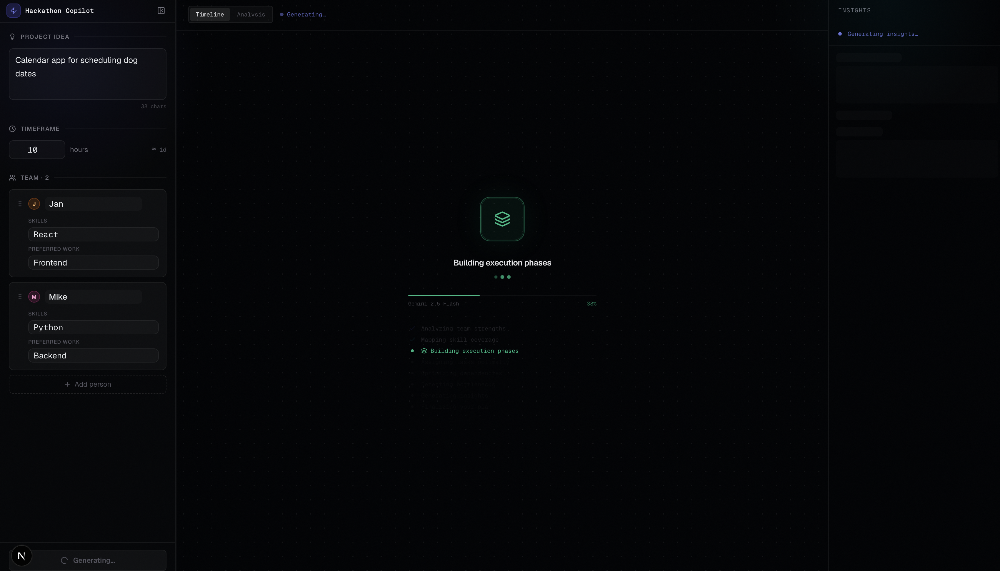
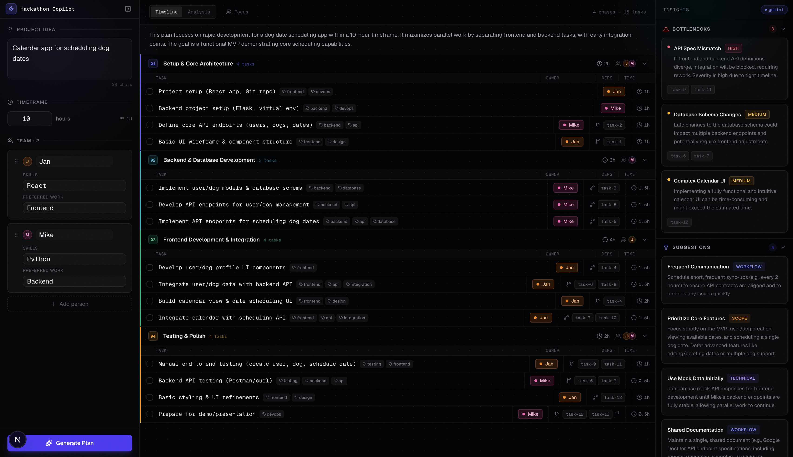
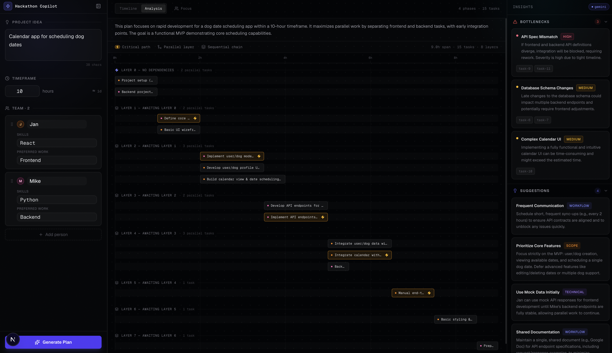
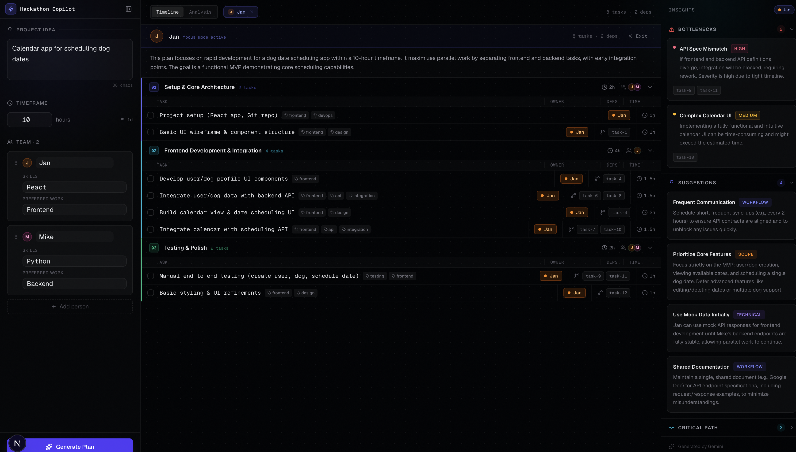
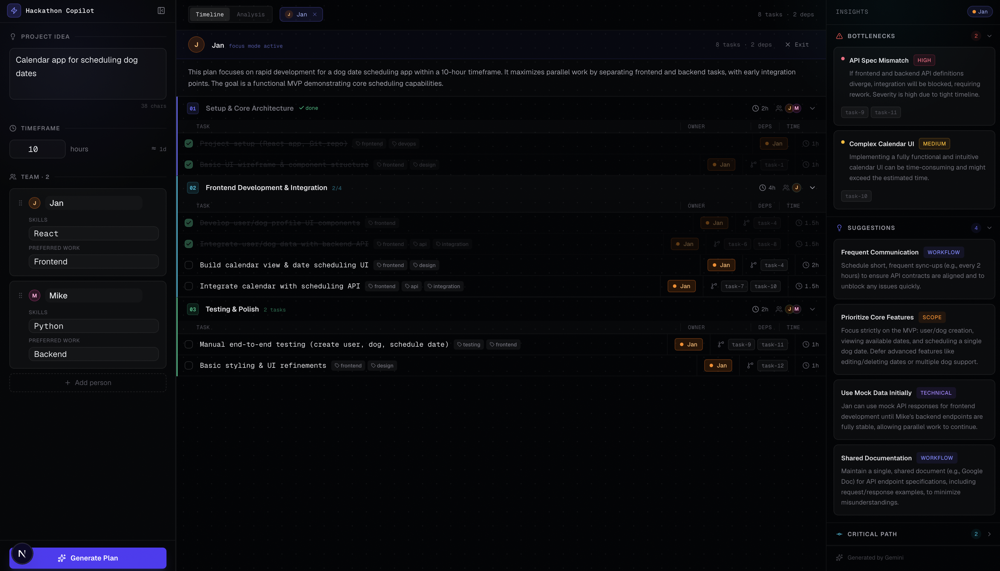

# Hackathon Copilot

An AI-powered planning tool that turns a project idea and team roster into a structured, phased execution plan. Built for hackathons and time-boxed sprints where you need to go from "what are we building?" to "who does what and when?" in under a minute.

---

## Project Overview

Hackathon Copilot takes a project description, a timeframe, and a list of team members (with their skills and preferred work) and produces a detailed execution plan structured around phases, tasks, dependencies, and team assignments. It also surfaces bottlenecks, risk warnings, and prioritized suggestions automatically.

The core problem it solves: at the start of a hackathon, teams often waste the first hour debating scope and responsibilities. This tool collapses that overhead by delegating the planning work to Gemini and giving the team an immediately actionable, dependency-aware breakdown.

**Workflow:**
1. User fills in the project idea, total timeframe, and team members via the left sidebar form
2. The form data is sent to a Next.js API route (`POST /api/plan`)
3. The API route calls the Gemini API with a structured prompt and validates the response using Zod
4. The parsed execution plan is returned to the frontend and rendered across three panels: timeline, analysis, and insights

---

## How It Works

### Data Flow

**Input → API**: The form collects a project idea (free text), a timeframe in hours, and team members each with a name, comma-separated skills, and a preferred work type. On submit, this is sent as JSON to `/api/plan`.

**API → Gemini**: The API route constructs a detailed system prompt that specifies the exact JSON schema Gemini must return, then calls `gemini-2.5-flash` with a formatted user prompt describing the team and project. The model responds with a structured JSON object.

**Validation**: The raw response is cleaned of any markdown fences, parsed with `JSON.parse`, then validated through Zod schemas. If parsing or validation fails, the route retries up to three times with exponential backoff before returning a 502 error.

**Rendering**: Once the plan lands on the client, it is rendered across:
- **Timeline view** — vertically stacked phases, each containing its assigned task rows with assignee badges, duration chips, and dependency chips
- **Analysis view** — a Gantt-style horizontal timeline that groups tasks by dependency depth (parallel layers vs sequential chains) and highlights the critical path in amber
- **Insights panel** — bottlenecks ranked by severity, actionable suggestions categorized by type, and overload warnings for team members with too much allocated work

### Fallback Behavior

If `GOOGLE_API_KEY` is not set, or if the API key is detected as invalid, the service immediately returns a pre-built mock plan without hitting the network. If the key is valid but Gemini returns a response that fails validation, the service retries up to three times before surfacing the error to the user.

The mock plan follows the exact same Zod schema as real responses — it passes through the same validation path — so the UI is indistinguishable between mock and live mode.

---

## Tech Stack

| Layer | Technology |
|---|---|
| Framework | Next.js 15 (App Router) |
| Language | TypeScript |
| Styling | Tailwind CSS v4 |
| Components | shadcn/ui |
| AI | Google Gemini (`gemini-2.5-flash`) |
| Schema validation | Zod |
| Animation | Framer Motion |

---

## Running Locally

```bash
# 1. Clone the repository
git clone <repo-url>
cd hackathon-copilot

# 2. Install dependencies
npm install

# 3. Add your Gemini API key (see Environment Variables below)
# Create .env.local and set GOOGLE_API_KEY
echo "GOOGLE_API_KEY=your_key_here" > .env.local

# 4. Start the development server
npm run dev
```

Open [http://localhost:3000](http://localhost:3000) in your browser.

---

## Environment Variables

Create a `.env.local` file in the project root:

```
GOOGLE_API_KEY=your_gemini_api_key_here
```

Get a key from [Google AI Studio](https://aistudio.google.com/apikey).

**If the key is missing or invalid**, the app automatically falls back to a built-in demo plan (see Fallback System below). No errors are shown — the app is fully functional in demo mode.

---

## Fallback System

When `GOOGLE_API_KEY` is absent or the key fails validation, `planService.ts` returns a hardcoded mock plan from `src/lib/mockPlan.ts` instead of calling Gemini.

The mock plan represents a realistic scenario: four engineers (Alice, Bob, Carol, Dave) building a real-time collaborative task manager over 48 hours. It includes five sequential phases (Foundation → Core Development → Integration → Polish → Ship & Demo), 27 tasks with cross-phase dependencies, two overload warnings, three bottleneck flags, four prioritized suggestions, and a six-task critical path.

Because the mock data is parsed through the same `GeminiResponseSchema.parse()` call as real responses, it validates correctly and exercises every rendering path in the UI. The only visible difference is the absence of the "gemini" source badge in the insights panel header.

---

## UI Features

### Loading State

After submitting the form, the center panel enters a loading state while the Gemini API processes the request. A pulsing indicator appears in the header and skeleton placeholders fill the timeline.



### Main Dashboard

Once the plan is generated, all three panels populate simultaneously. The left sidebar shows the input form (collapsible), the center shows the execution timeline organized by phase, and the right panel displays insights.



### Time Analysis View

Switching to the "Analysis" tab renders a Gantt-style horizontal timeline. Tasks are grouped by dependency depth into parallel layers — tasks with no dependencies appear in Layer 0 and can all run simultaneously; tasks that depend on Layer 0 appear in Layer 1, and so on. Critical path tasks are highlighted in amber with a lightning bolt icon. Hovering any bar shows the task owner, duration, scheduled time window, and its dependency IDs.



### Focus Mode

Clicking "Focus" in the center panel header opens a person picker. Selecting a teammate filters the entire plan — both the timeline and insights panel — to show only that person's assigned tasks, plus dependency chips indicating what they're blocked on from other team members. An indigo banner appears below the header with the person's name and task count. Focus mode is exited via the ✕ button in the pill or the "Exit" button in the banner.



### Task Completion

Tasks can be marked as complete directly from the timeline. Completed tasks are visually distinguished from pending ones, giving the team a live view of progress against the plan during the hackathon itself.



---

## Future Improvements

- **Dependency graph visualization** — an interactive DAG view showing task relationships as a directed graph rather than sequential phase rows
- **Real-time collaboration** — shared plan state across team members so everyone sees task completions and updates live
- **Export integrations** — push the generated plan directly to Notion, GitHub Issues, or Linear as structured items
- **Calendar integration** — map the phase schedule onto a Google Calendar or iCal feed based on the actual start time
- **Improved AI planning accuracy** — fine-tune prompts for domain-specific hackathon types (ML, mobile, hardware, design sprints) and incorporate team velocity data from past projects
